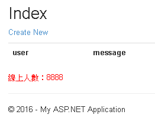

# 實作(一) - 簡單入門

在Shared裡新增view，檔名為：partial_01.cshtml

```csharp
<span style="color:red">線上人數：8888</span>
```

在index.cshtml最下方加上以下語法

```csharp
@Html.Partial("Partial_01")
```

執行後的結果



如果同個 /views/controller/ 下也有同檔名的view，就會先以該 view 做為 partial view 來源

結論：

如果用@Html.Partial("Partial_01")
就會先抓/Shared/Partial_01.cshtml
如果這個檔案不存在，就會改抓/views/controller/Partial_01.cshtml