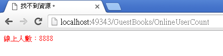

# 實作(三) - 通過Action載入PartialView

在Views/Controller裡新增view，檔名為：OnlineUserCount.cshtml

```html
<p>@ViewBag.message</p>
<span style="color:red">線上人數：8888</span>
```

在Controller裡，新增Action

```csharp
public ActionResult OnlineUserCount()
{
		ViewBag.message = "zzz";
		return PartialView();
}
```

在該 Controller 裡的 index.cshtml 內最後一行加上

```csharp
@Html.Action("OnlineUserCount")
```

執行後的結果

/GuestBooks/index



如果 index.cshtml 內最後一行輸入的是

```csharp
@Html.Partial("OnlineUserCount")
```

就不會出現zzz這個部份。

原因是因為未經過 Action 的 ViewBag 給定資料