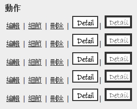

# 顯示連結的方式

---

[kevinya](https://dotblogs.com.tw/kevinya/2013/11/16/129708)

@Html.ActionLink 是最基本的方式顯示超連結，像是grid上面顯示的 編輯、刪除連結都是

用這個顯示，純文字的超連結：

```csharp
@Html.ActionLink("編輯", "Edit", new { id = item.No }) |
@Html.ActionLink("細節", "Details", new { id = item.No }) |
@Html.ActionLink("刪除", "Delete", new { id = item.No }) 
```

使用 href 或是 @Html.ImgWithLink 都可以設定圖片為超連結

而 @Html.ImgWithLink 還可以設定此超連結的屬性，例如寬度，border...之類，功能較 href 強

```html
<a href="@Url.Action("Details", new { id = item.No })" >
</a>|
@Html.ImgWithLink(@Url.Action("Details", new { id = item.No }),
 "http://img843.imageshack.us/img843/3608/34gs.jpg", "自訂HtmlHelper顯示圖片超連結"
, new { border = "4px" })
```



以上的連結都是跟資料庫有關連的超連結，如果要做靜態的超連結單純連到某個網頁就如下:

```
<a href="@Url.Content("~/Store/")">Store</a>
```