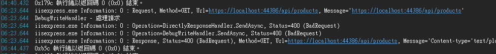

# 阻擋 request

相較於要同時處理 request & response 的情況

這個做法主要是用於：先判斷，如果不符合條件，就立即給予回應，省去之後多餘的處理

```csharp
// 在 WebConfig.cs 中新增以下語法
config.MessageHandlers.Add(new DirectlyResponseHandler());

// 新增以下類別
public class DirectlyResponseHandler : DelegatingHandler
{
    protected override Task<HttpResponseMessage> SendAsync(HttpRequestMessage request, CancellationToken cancellationToken)
    {
        var response = new HttpResponseMessage(HttpStatusCode.BadRequest)
        {
            Content = new StringContent("驗證不通過!")
        };

        var tsc = new TaskCompletionSource<HttpResponseMessage>();
        tsc.SetResult(response);
        return tsc.Task;

        // 不呼叫 base.SendAsync
        //return base.SendAsync(request, cancellationToken);
    }
}
```

執行結果


