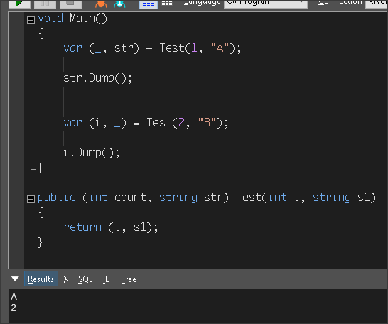
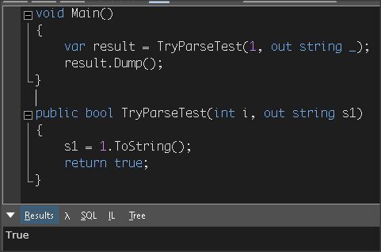
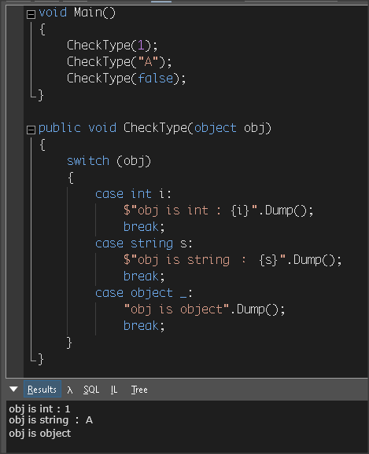

# [Discards](https://docs.microsoft.com/en-us/dotnet/csharp/discards)

以 _ 來做為假的變數來呼叫 method 或承接變數

## Tuple 範例

```csharp
void Main()
{
    var (_, str) = Test(1, "A");
  
    str.Dump();


    var (i, _) = Test(2, "B");

    i.Dump();
}

public (int count, string str) Test(int i, string s1)
{
    return (i, s1);
}
```

執行結果



## out 範例

```csharp
void Main()
{
    var result = TryParseTest(1, out string _);
    result.Dump();
}

public bool TryParseTest(int i, out string s1)
{
    s1 = 1.ToString();
    return true;
}
```

執行結果



## Pattern matching 範例

```csharp
void Main()
{
    CheckType(1);
    CheckType("S");
    CheckType(false);
}

public void CheckType(object obj)
{
    switch (obj)
    {
        case int i:
            $"obj is int : {i}".Dump();
            break;
        case string s:
            "obj is string : {s}".Dump();
            break;
        case object _:
            "obj is object".Dump();
            break;
    }
}
```

執行結果



## 承接變數

```csharp
void Main()
{
    _ = TryParseTest(1, out string _);
}

public bool TryParseTest(int i, out string s1)
{
    s1 = 1.ToString();
    return true;
}
```
