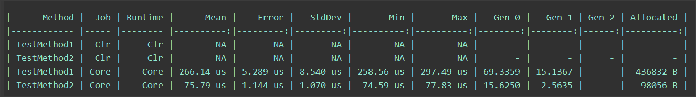

# 分頁

## 效能較優

```csharp
private IEnumerable<IEnumerable<T>> ToPaged<T>(IEnumerable<T> source, int chunksize = 99)
{
    if (source == null)
    {
        return Enumerable.Empty<IEnumerable<T>>();
    }

    return source.Select((v, i) => new 
                                    {
                                        index = i
                                        , value = v
                                    })
                    .GroupBy(a => a.index / chunksize)
                    .Select(d => d.Select(d2 => d2.value));
}
```
## 效能其次

```csharp
private IEnumerable<IEnumerable<T>> Chunk<T>(IEnumerable<T> source, int chunksize = 99)
{
    if (source != null)
    {
        IEnumerable<T> sourceArray = source as T[] ?? source.ToArray();
        while (sourceArray.Any())
        {
            yield return sourceArray.Take(chunksize);
            sourceArray = sourceArray.Skip(chunksize).ToArray();
        }
    }
}
```

## BenchmarkDotnet 結果

### 效能比較



```csharp
using System;
using System.Collections.Generic;
using System.Linq;
using BenchmarkDotNet.Attributes;
using BenchmarkDotNet.Running;

namespace ConsoleApp1
{
    class Program
    {
        static void Main(string[] args)
        {
            var summary = BenchmarkRunner.Run<TestRunner>();
        }
    }

    [ClrJob, MonoJob, CoreJob] // 可以針對不同的 CLR 進行測試
    [MinColumn, MaxColumn]
    [MemoryDiagnoser]
    public class TestRunner
    {
        private readonly TestClass _test = new TestClass();

        public TestRunner()
        {
        }

        [Benchmark]
        public void TestMethod1() => _test.TestMethod1();

        [Benchmark]
        public void TestMethod2() => _test.TestMethod2();
    }

    public class TestClass
    {
        public void TestMethod1()
        {
            var result = Chunk1(Enumerable.Range(1, 1000), 5).ToArray();
        }

        private IEnumerable<IEnumerable<T>> Chunk1<T>(IEnumerable<T> source, int chunksize = 99)
        {
            if (source != null)
            {
                IEnumerable<T> sourceArray = source as T[] ?? source.ToArray();
                while (sourceArray.Any())
                {
                    yield return sourceArray.Take(chunksize);
                    sourceArray = sourceArray.Skip(chunksize).ToArray();
                }
            }
        }
        
        public void TestMethod2()
        {
            var result = Chunk2(Enumerable.Range(1, 1000), 5).ToArray();
        }
        
        private IEnumerable<IEnumerable<T>> Chunk2<T>(IEnumerable<T> source, int chunksize = 99)
        {
            if (source == null)
            {
                return Enumerable.Empty<IEnumerable<T>>();
            }

            return source.Select((v, i) => new
                                           {
                                               index = i
                                             , value = v
                                           })
                         .GroupBy(a => a.index / chunksize)
                         .Select(d => d.Select(d2 => d2.value));
        }
    }
}
```

## 範例

```csharp
async Task Main()
{
    var tasks = Enumerable.Range(101, 100)
                          .ToPaged(4)
                          .Select(async a => await RunTask(a.Select(a2 => a2)));

    var result = (await Task.WhenAll(tasks)).SelectMany(r => r);
    "Complete".Dump();
    result.Dump();
}

private async Task<IEnumerable<int>> RunTask(IEnumerable<int> ints)
{
    $"Thread Id:{Thread.CurrentThread.ManagedThreadId} Start".Dump();
    ints.Dump();
    await Task.Delay(1000);
    $"Thread Id:{Thread.CurrentThread.ManagedThreadId} End".Dump();
    return ints;
}
```
