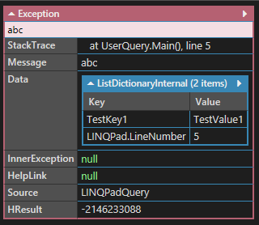

# Exception

[C# exception handling best practices](https://blog.elmah.io/csharp-exception-handling-best-practices/)

```csharp
void Main()
{
    try
    {
        throw new Exception("abc");
    }
    catch (Exception ex)
    {
        ex.Data.Add("TestKey1", "TestValue1");
        throw;
    }
}
```

執行結果

