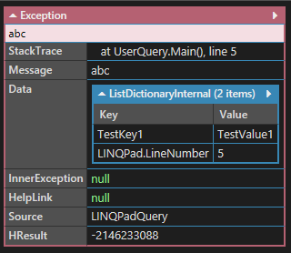

# Exception

[C# exception handling best practices](https://blog.elmah.io/csharp-exception-handling-best-practices/)

### Exception 增加自訂資料

```csharp
void Main()
{
    try
    {
        throw new Exception("abc");
    }
    catch (Exception ex)
    {
        ex.Data.Add("TestKey1", "TestValue1");
        throw;
    }
}
```

執行結果




### 待處理：抓出 Exception 的 StackeTrace ，從各 Stacke MethodInfo 抓出 Custom Attribute 

```cs
var stackTrace = new StackTrace(ex, true);
var ownerMessages = stackTrace.GetFrames()
                                .SelectMany(frame => frame.GetMethod()
                                                        .GetCustomAttributes(typeof(OwnerMessageAttribute), true)
                                                        .Cast<OwnerMessageAttribute>()
                                                        .Select(attribute => attribute.Message))
                                .ToArray(); 
```