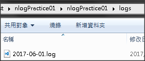

## 安裝套件
- Install-Package NLog
- Install-Package NLog.Config

## app.config / web.config
- Console 不用設定這個項目
- Console 要記得將 NLog.config 設定為複製至輸出目錄
- \<configSections> 必須位於 \<configuration> 的第一個子元素中

```xml
<configuration>
  <configSections>
      <section name="nlog" type="NLog.Config.ConfigSectionHandler, NLog" />
  </configSections>
</configuration>
```

### NLog.config
- targets、rules 註解裡面有預設可用的設定
- targets 
  - 設定 log 檔名格式 (fileName)
  - 設定 log 內容格式 (layout)

rules 設定 log routing 規則，下面的範例是全域性的設定
```xml
<targets>
  <target xsi:type="File" 
          name="f" 
          fileName="${basedir}/logs/${shortdate}.log"
          layout="${longdate} ${uppercase:${level}} ${message}" />
</targets>

<rules>
  <logger name="*" minlevel="Debug" writeTo="f" />
</rules>
```

## C#

Action
- using NLog;
- 語法格式 logger.level( message )

```csharp
public ActionResult Index()
{
    Logger logger = LogManager.GetCurrentClassLogger();
    logger.Trace("我是Trace");
    logger.Debug("我是Debug");
    logger.Info("我是Info");
    logger.Warn("我是Warn");
    logger.Error("我是Error");
    logger.Fatal("我是Fatal");

    return View();
}
```
## 執行後，會在專案目錄 > logs 產生 log 檔


## log 檔的內容
以系統編碼儲存

```
2017-06-01 09:17:05.0460 DEBUG 我是Debug
2017-06-01 09:17:05.0650 INFO 我是Info
2017-06-01 09:17:05.0700 WARN 我是Warn
2017-06-01 09:17:05.0700 ERROR 我是Error
2017-06-01 09:17:05.0700 FATAL 我是Fatal
```