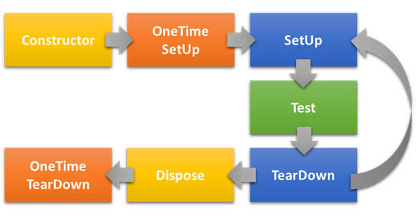

# 生命週期 Lifecycle

https://blog.johnwu.cc/article/nunit-life-cycle.html

Class 宣告

- TestFixture

```
OneTimeSetUp
    SetUp
    Test
    TearDown
OneTimeTearDown
```




```csharp
[TestFixture]
public class Lifecycle : IDisposable
{
    public Lifecycle()
    {
    }

    public void Dispose()
    {
    }

    [OneTimeSetUp]
    public void OneTimeSetUp()
    {
    }

    [OneTimeTearDown]
    public void OneTimeTearDown()
    {
    }

    [SetUp]
    public void TestSetUp()
    {
    }

    [TearDown]
    public void TestTearDown()
    {
    }

    [Test]
    public void FirstTest()
    {
    }

    [Test]
    public void SecondTest()
    {
    }
}
```