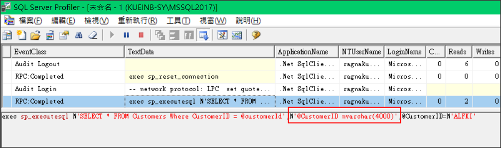

# DynamicParameters

## 未指定長度時

```csharp
string Connection = "Data Source=.\\mssql2017;Initial Catalog=Northwind;Integrated Security=True";

var param = new { CustomerID = "ALFKI" };

using (SqlConnection conn = new SqlConnection(Connection))
{
    conn.Query<dynamic>(@"SELECT * FROM Customers Where CustomerID = @customerId", param).Dump();
}
```



## 使用 DynamicParameters 並指定長度

```csharp
string Connection = "Data Source=.\\mssql2017;Initial Catalog=Northwind;Integrated Security=True";

var param = new DynamicParameters();
param.Add("CustomerID", "ALFKI", DbType.String, size: 20);

using (SqlConnection conn = new SqlConnection(Connection))
{
    conn.Query<dynamic>(@"SELECT * FROM Customers Where CustomerID = @customerId", param).Dump();
}
```

## DbType String 型別

如果不指定長度，就會以 4000 處理，就可能會造成效能 issue
| C# DbType | DB Type |
|-----------|---------|
|DbType.AnsiString|varchar|
|DbType.String|nvarchar|
|DbType.AnsiStringFixedLength|char|
|DbType.StringFixedLength|nchar|

## DbType 型別

目前可提供的型別對應如下：
| DB Type |
|---------|
|AnsiString|
|Binary|
|Byte|
|Boolean|
|Currency|
|Date|
|DateTime|
|Decimal|
|Double|
|Guid|
|Int16|
|Int32|
|Int64|
|Object|
|SByte|
|Single|
|String|
|Time|
|UInt16|
|UInt32|
|UInt64|
|VarNumeric|
|AnsiStringFixedLength|
|StringFixedLength|
|Xml|
|DateTime2|
|DateTimeOffset|

## 延伸閱讀

DbString 可對應至 DbType.AnsiString 及 DbType.String，但是無法對應至其他型別

| 參數名 | 說明 |
| ------ | ---- |
| IsAnsi | 是否為 Ansi 字串 (UTF-8 不是 Ansi 字串) |
| IsFixedLength | 是否為固定長度 |
| Length | 欄位長度 |

| IsAnsi      | IsFixedLength | DbType |
| ----------- | ------------- | ------ |
| true  | false | varchar |
| false | false | nvarchar |
| true  | true | char |
| false | true | nchar |
