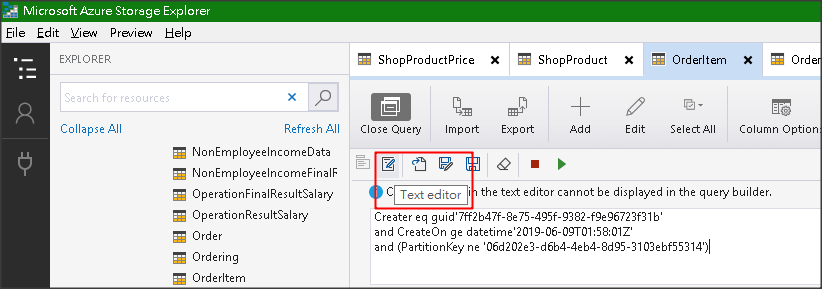

## 透過 SDK 組 Query Condition

``` csharp
var query = TableQuery.CombineFilters(
                                        TableQuery.GenerateFilterCondition("Level", QueryComparisons.Equal, "ERROR"), 
                                        TableOperators.And, 
                                        TableQuery.GenerateFilterConditionForDate("Timestamp", QueryComparisons.GreaterThanOrEqual, DateTimeOffset.Now.AddDays(-20).Date));

var query2 = TableQuery.CombineFilters(query,
                                        TableOperators.And, 
                                        TableQuery.GenerateFilterConditionForDate("Timestamp", QueryComparisons.LessThanOrEqual, DateTimeOffset.Now));

var exQuery = new TableQuery<LogEntry>().Where(query2);
```

可透過 Azure Storage Explorer 來產生對應的 Query Condition

