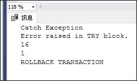

# TRY CATCH RAISERROR TRANSACTION

```sql
BEGIN TRY
    BEGIN TRANSACTION Test

    RAISERROR ('Error raised in TRY block.', -- Message text.  
        16, -- Severity.  
        1 -- State.  
    );  

    COMMIT TRANSACTION Test
END TRY
BEGIN CATCH
    PRINT 'Catch Exception'
    PRINT ERROR_MESSAGE()
    PRINT ERROR_SEVERITY()
    PRINT ERROR_STATE()
    ROLLBACK TRANSACTION Test
    PRINT 'ROLLBACK TRANSACTION'
END CATCH
```



```sql
BEGIN TRY
    BEGIN TRANSACTION AddInterfaceTransMailRecipient
    PRINT N'開始新增 InterfaceTransMailRecipient 參數'

    DECLARE @newConfigurationItemId UNIQUEIDENTIFIER = '207837D2-1604-49D3-83CD-9B836D36ECA2'
    INSERT INTO ba.xxx(xx, xx, xx, xx, xx, xx)
    VALUES(@newConfigurationItemId, N'Foundation', N'InterfaceTransMailRecipient', 78, N'Interface 排程拋轉異常時所通知之人員', N'Interface 排程拋轉異常時所通知之人員')

    COMMIT TRANSACTION AddInterfaceTransMailRecipient
    PRINT N'新增 InterfaceTransMailRecipient 參數處理完畢'
END TRY
BEGIN CATCH
    PRINT N'新增 InterfaceTransMailRecipient 參數失敗'
    PRINT ERROR_MESSAGE()
    ROLLBACK TRANSACTION AddInterfaceTransMailRecipient
    PRINT N'ROLLBACK AddInterfaceTransMailRecipient TRANSACTION'
END CATCH
```
