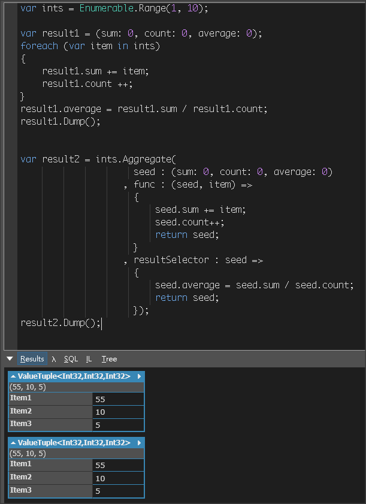

# Aggregate

可用來做為 foreach 的簡化，讓邏輯的處理語法更為集中

套用 Aggregate 前

```csharp
var ints = Enumerable.Range(1, 10);

var result1 = (sum: 0, count: 0, average: 0);
foreach (var item in ints)
{
    result1.sum += item;
    result1.count ++;
}
result1.average = result1.sum / result1.count;
result1.Dump();
```

套用 Aggregate 後

```csharp
var result2 = ints.Aggregate(
                     seed : (sum: 0, count: 0, average: 0)
                   , func : (seed, item) =>
                     {
                         seed.sum += item;
                         seed.count++;
                         return seed;
                     }
                   , resultSelector : seed =>
                     {
                         seed.average = seed.sum / seed.count;
                         return seed;
                     });
result2.Dump();
```

實際執行結果


