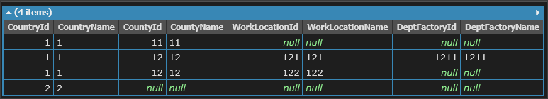
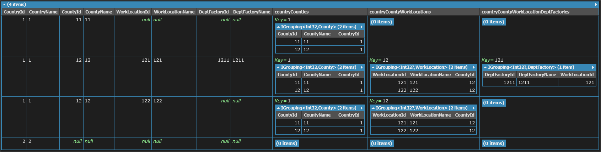

# left join 三層 sample

目的：
> 給定二二一組關聯的資料，總共三組關聯，從上到下分別是 Country > County > WorkLocation > Deptfactory，要以 類似 SQL Left Join 的方式把整個資料攤平展開

說明：
- DefaultIfEmpty - 當左邊的資料元素，不存在於右邊的關聯時，也要顯示出來。Left Join 的關鍵。
- equals 前後的欄位都要加上 ?. 的處理，避免 NullReference Exception

```csharp
void Main()
{
    var countries = new[] {
        new Country {
            CountryId = 1,
            CountryName = "1"
        },
            new Country {
            CountryId = 2,
            CountryName = "2"
        }
    };

    var counties = new[] {
        new County {
            CountyId = 11,
            CountyName = "11",
            CountryId = 1
        },
        new County {
            CountyId = 12,
            CountyName = "12",
            CountryId = 1
        },
    };

    var workLocations = new[]{
        new WorkLocation{
            WorkLocationId = 121,
            WorkLocationName = "121",
            CountyId = 12
        },
        new WorkLocation{
            WorkLocationId = 122,
            WorkLocationName = "122",
            CountyId = 12
        }
    };

    var deptFactories = new []{
        new DeptFactory{
            DeptFactoryId = 1211,
            DeptFactoryName = "1211",
            WorkLocationId = 121
        }
    };


    var result =
        from country in countries
        join county in counties
            on country.CountryId equals county.CountryId
            into countryCounties

        from countryCounty in countryCounties.DefaultIfEmpty()
        join workLocation in workLocations
            on countryCounty?.CountyId equals workLocation?.CountyId
            into countryCountyWorkLocations

        from countryCountyWorkLocation in countryCountyWorkLocations.DefaultIfEmpty()
        join deptFactory in deptFactories
            on countryCountyWorkLocation?.WorkLocationId equals deptFactory?.WorkLocationId
            into countryCountyWorkLocationDeptFactories

        from countryCountyWorkLocationDeptFactory in countryCountyWorkLocationDeptFactories.DefaultIfEmpty()

        select new {
            country?.CountryId,
            country?.CountryName,
            countryCounty?.CountyId,
            countryCounty?.CountyName,
            countryCountyWorkLocation?.WorkLocationId,
            countryCountyWorkLocation?.WorkLocationName,
            countryCountyWorkLocationDeptFactory?.DeptFactoryId,
            countryCountyWorkLocationDeptFactory?.DeptFactoryName,

            // countryCounties,
            // countryCountyWorkLocations,
            // countryCountyWorkLocationDeptFactories
        };

    result.Dump();
}

public class Country
{
    public int CountryId { get; set; }
    public string CountryName { get; set; }
}

public class County
{
    public int CountyId { get; set; }
    public string CountyName { get; set; }
    public int CountryId { get; set; }
}

public class WorkLocation
{
    public int WorkLocationId { get; set; }
    public string WorkLocationName { get; set; }
    public int CountyId { get; set; }
}

public class DeptFactory
{
    public int DeptFactoryId { get; set; }
    public string DeptFactoryName { get; set; }
    public int WorkLocationId { get; set; }
}
```

執行結果



如果取消註解下面三行程式碼，就可以取出該父類下的所有子類資料

```csharp
        select new {
            country?.CountryId,
            country?.CountryName,
            countryCounty?.CountyId,
            countryCounty?.CountyName,
            countryCountyWorkLocation?.WorkLocationId,
            countryCountyWorkLocation?.WorkLocationName,
            countryCountyWorkLocationDeptFactory?.DeptFactoryId,
            countryCountyWorkLocationDeptFactory?.DeptFactoryName,

            // countryCounties,
            // countryCountyWorkLocations,
            // countryCountyWorkLocationDeptFactories
        };
```

執行結果


