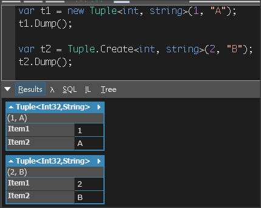

# [Tuple Class](https://docs.microsoft.com/zh-tw/dotnet/api/system.tuple?view=netframework-4.8)

- Reference Type
- Property 不具名的元素集合
- 每個 Property 都是 ReadOnly
- 每個 Property 依序是 item1、item2 ．．． item16 (如果要使有意義命名，要改用 ValueTuple)

建立 Tuple\<Tx> 的方式

```csharp
var t1 = new Tuple<int, string>(1, "A");
t1.Dump();

var t2 = Tuple.Create<int, string>(2, "B");
t2.Dump();
```

執行結果


