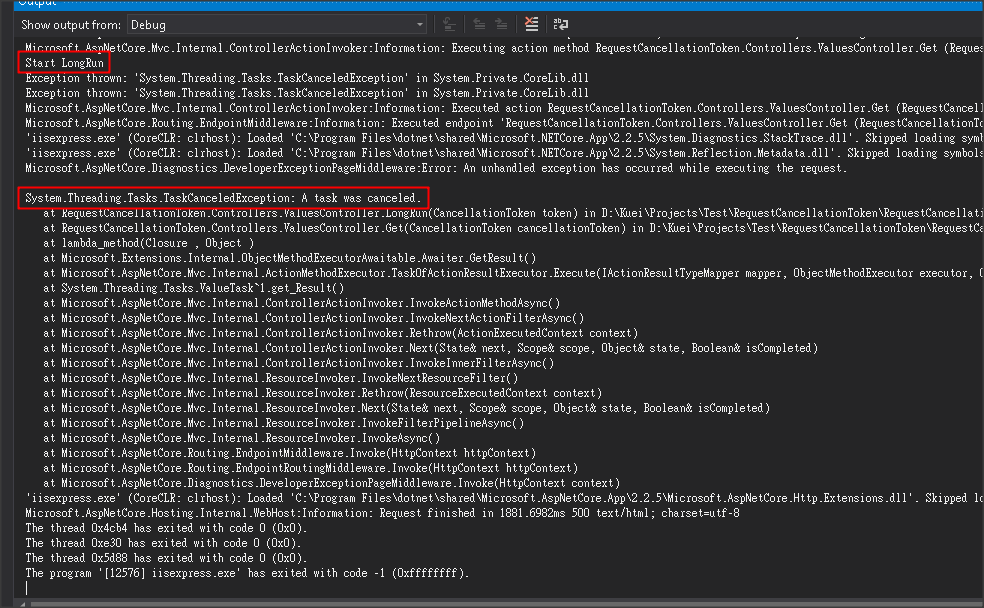

# 非同步使用 CancellationToken

在使用 async 方法時，讓 cancel request token 可以 cancel task

只需要在 Action 的 引數加上 CancellationToken 參數就可以了

```csharp
[HttpGet]
public async Task<ActionResult> Get(CancellationToken cancellationToken)
{
    Debug.WriteLine("Start LongRun");

    await LongRun(cancellationToken);

    return Ok();
}

private async Task LongRun(CancellationToken token)
{
    await Task.Delay(10000, token);
}
```

從圖中可以看出實際執行的結果

Start LongRun 之後，在等待 10 秒的期間內，取消 Request 後

就可以看到 task cancel 的訊息 !


