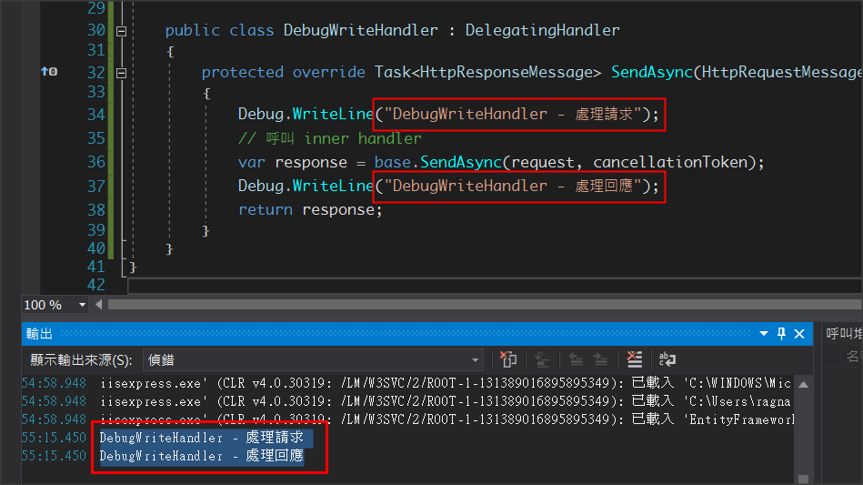
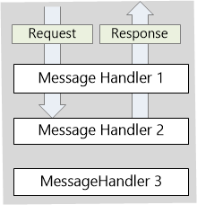
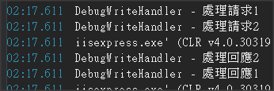

# request & response 的流程處理

## Sample 1


```csharp
// 註冊 Debug MessageHandlers 至 WebApi.config
config.MessageHandlers.Add(new DebugWriteHandler());

// 新增 語法
public class DebugWriteHandler : DelegatingHandler
{
    protected override Task<HttpResponseMessage> SendAsync(HttpRequestMessage request, CancellationToken cancellationToken)
    {
        Debug.WriteLine("DebugWriteHandler - 處理請求");
        // 呼叫 inner handler
        var response = base.SendAsync(request, cancellationToken);
        Debug.WriteLine("DebugWriteHandler - 處理回應");
        return response;
    }
}
```

### 執行結果



[資料來源](https://docs.microsoft.com/en-us/aspnet/web-api/overview/advanced/http-message-handlers)

## Sample 2

```csharp
// 註冊 Debug MessageHandlers 至 WebApi.config
config.MessageHandlers.Add(new DebugWriteHandler1());
config.MessageHandlers.Add(new DebugWriteHandler2());

// 新增 語法
public class DebugWriteHandler1 : DelegatingHandler
{
    protected override Task<HttpResponseMessage> SendAsync(HttpRequestMessage request, CancellationToken cancellationToken)
    {
        Debug.WriteLine("DebugWriteHandler - 處理請求1");
        // 呼叫 inner handler
        var response = base.SendAsync(request, cancellationToken);
        Debug.WriteLine("DebugWriteHandler - 處理回應1");
        return response;
    }
}

public class DebugWriteHandler2 : DelegatingHandler
{
    protected override Task<HttpResponseMessage> SendAsync(HttpRequestMessage request, CancellationToken cancellationToken)
    {
        Debug.WriteLine("DebugWriteHandler - 處理請求2");
        // 呼叫 inner handler
        var response = base.SendAsync(request, cancellationToken);
        Debug.WriteLine("DebugWriteHandler - 處理回應2");
        return response;
    }
}
```

### 執行結果

可以很明顯看到下圖的處理流程結果





[[資料來源](https://docs.microsoft.com/en-us/aspnet/web-api/overview/advanced/http-message-handlers)
