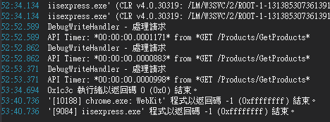

#

加入以下語法至 WebApiConfig.cs 中

```csharp
config.MessageHandlers.Add(new DebugWriteHandler());
```

新增 Custom MessageHandler

```csharp
public class DebugWriteHandler : DelegatingHandler
{
    protected override Task<HttpResponseMessage> SendAsync(HttpRequestMessage request, CancellationToken cancellationToken)
    {
        Debug.WriteLine("DebugWriteHandler - 處理請求");
        // 呼叫 inner handler
        return base.SendAsync(request, cancellationToken);
        Debug.WriteLine("DebugWriteHandler - 處理回應"); // 不會執行
    }
}
```

### 執行結果



要有回應可改為

```csharp
public class DebugWriteHandler : DelegatingHandler
{
    protected override Task<HttpResponseMessage> SendAsync(HttpRequestMessage request, CancellationToken cancellationToken)
    {
        Debug.WriteLine("DebugWriteHandler - 處理請求");
        // 呼叫 inner handler
        var response = base.SendAsync(request, cancellationToken);
        Debug.WriteLine("DebugWriteHandler - 處理回應");

        return response;
    }
}
```
