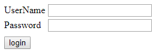
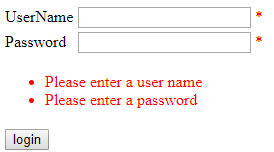

# [ValidationSummary](https://docs.microsoft.com/zh-tw/dotnet/api/system.web.ui.webcontrols.validationsummary)

用來顯示 Validator 於驗証失敗時的訊息

## RequiredFieldValidator

```html
<form id="form1" runat="server">
  <table>
    <tr>
      <td>
        <label for="username">UserName</label>
      </td>
      <td>
        <asp:TextBox ID="username" runat="server"></asp:TextBox>
        <asp:RequiredFieldValidator
          ID="user"
          runat="server"
          ControlToValidate="username"
          ErrorMessage="Please enter a user name"
          ForeColor="Red"
          >*</asp:RequiredFieldValidator
        >
      </td>
    </tr>
    <tr>
      <td>
        <label for="password">Password</label>
      </td>
      <td>
        <asp:TextBox ID="password" runat="server"></asp:TextBox>
        <asp:RequiredFieldValidator
          ID="pass"
          runat="server"
          ControlToValidate="password"
          ErrorMessage="Please enter a password"
          ForeColor="Red"
          >*</asp:RequiredFieldValidator
        >
      </td>
    </tr>
    <tr>
      <td colspan="2">
        <asp:ValidationSummary
          ID="ValidationSummary1"
          runat="server"
          ForeColor="Red"
        />
      </td>
    </tr>
    <tr>
      <td colspan="2">
        <asp:Button ID="Button1" runat="server" Text="login" />
      </td>
    </tr>
  </table>
</form>
```




---

## [CustomValidator](https://docs.microsoft.com/zh-tw/dotnet/api/system.web.ui.webcontrols.customvalidator)

- 有二種驗証來源

  - Client 端
    - 透過 attribute ClientValidationFunction 來指定
    - 以 javascript 來執行
  - Server 端
    - 透過 attribute OnServerValidate 來指定
    - postback 來執行

- 執行順序 - 先 Client 再 Server

- 執行時機 - onblur (失去焦點)

- 執行邏輯 - 觸驗証端動作後，再以 args.IsValid 來判斷是否驗証通過或失敗。所以在驗証的 method 內，都要記得給定 args.IsValid 驗証結果。

  > 注意：因為執行時機是 onblur，如果又在 Client 端驗証通過加上 alert 的動作，那麼在驗証通過後，必須再一次觸發 commit 的動作 !!

```html
<head runat="server">
  <meta http-equiv="Content-Type" content="text/html; charset=utf-8" />
  <title></title>
  <script type="text/javascript">
    function ClientValidation(source, args) {
      if (args.Value % 2 == 0) {
        args.IsValid = true;
        // window.alert("驗證成功，偶數！");
        console.log("驗證成功，偶數！");
      } else {
        args.IsValid = false;
        // window.alert("驗證失敗，奇數！（無法被二整除）");
        console.log("驗證失敗，奇數！（無法被二整除）");
      }

      return;
    }
  </script>
</head>
<body>
  <form id="form1" runat="server">
    請輸入偶數：<asp:TextBox ID="TextBox1" runat="server"></asp:TextBox>

    <asp:Button ID="Button1" runat="server" Text="Button" />

    <asp:CustomValidator
      ID="CustomValidator1"
      runat="server"
      OnServerValidate="ServerValidation"
      ClientValidationFunction="ClientValidation"
      ErrorMessage="CustomValidator -- 不是偶數！！"
      ForeColor="Red"
      ControlToValidate="TextBox1"
    ></asp:CustomValidator>
  </form>
</body>
```

```csharp
protected void ServerValidation(object source, ServerValidateEventArgs args)
{
    try
    {
        int i = int.Parse(args.Value);
        args.IsValid = ((i % 2) == 0);
    }

    catch (Exception ex)
    {
        args.IsValid = false;
    }
}
```

---

## CompareValidator

---

## RangeValidator

---

## RegularExpresion

---

## DynamicValidator
