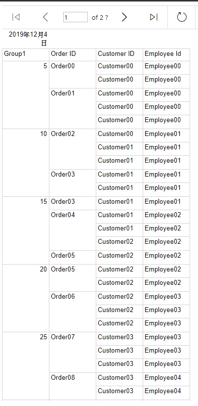
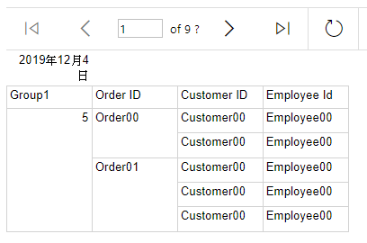
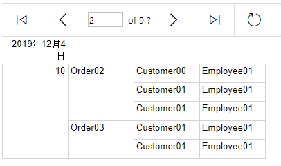
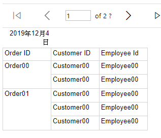

# 以每五筆資料做分頁

做法簡述

> 以 Group 欄位 + RowNumber 的方式來達成

設定方式

1. 資料列群組 > 第一個項目上，按下滑鼠右鍵 > 加入群組 > 父群組
1. 群組依據 > 運算式 > `=RowNumber(Nothing)`
1. 按下 `確定` > 建立群組欄位 (以下簡稱此欄位為 `群組欄位 No` )
1. 開啟 `群組欄位 No` 的 `群組屬性`
1. 群組屬性 > 排序 > 刪除排序規則
1. 檢視報表，確認可顯示報表

   > 因為群組是先依照 RowNumber 排序，所以看不出原本的群組規則

1. 開啟 `群組欄位 No` 的 `群組屬性` > 一般 > 群組對象 > 運算式 > 改為 `=Ceiling(RowNumber(Nothing)/5)`

   > 除以 5 是指每 5 筆為一個群組

1. 檢視報表

   > - 此時會看到報表內容，會以每 5 筆為一個群組，在該群組內，再依照原本的群組規則顯示。
   > - 每 5 筆群組的欄位值，就會是該群組最後一筆的 RowNumber 值

   

1. 開啟 `群組欄位 No` 的 `群組屬性` >分頁符號 > 勾選 `在群組的每個執行個體之間`
1. 檢視報表

   
   

1. 於 Table 中刪除 `群組欄位 No` > 選擇 `只刪除資料行` > 確定
1. 檢視報表

   

1. 完成

[參考資料](https://www.youtube.com/watch?v=nBYn1DU3VMQ&list=PL7A29088C98E92D5F&index=5)