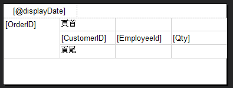
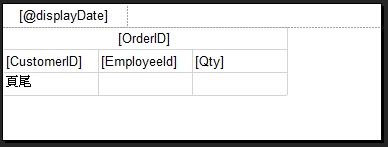
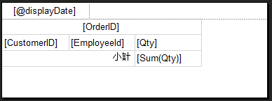
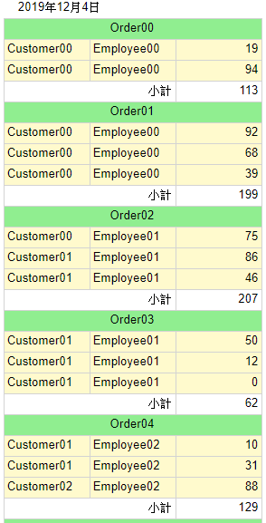

# 垂直群組及小計

設定方式

1. 加入群組 > 父群組 > 加入群組頁首 & 加入群組頁尾

   

1. 移除上方設定的 `群組欄位`

   > 注意：不要刪除到群組依據設定

1. 頁首

   把`群組欄位`設定到 頁首 > 合併所有頁首儲存格 > 欄位置中

   

1. 頁尾

   - 把`小計`設定到頁尾 > 運算式套用 Sum()
   - 合併小計欄位左方所有欄位 > 欄位靠右

   

1. 顯示報表

   
