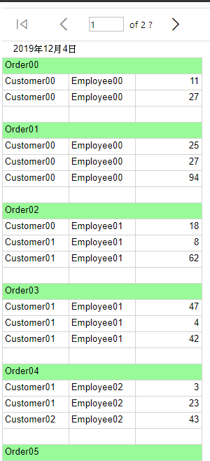
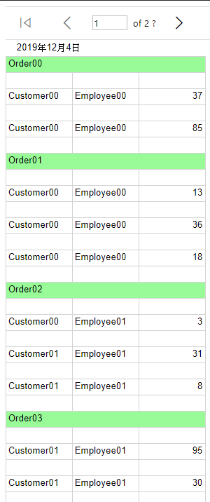
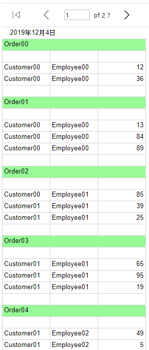
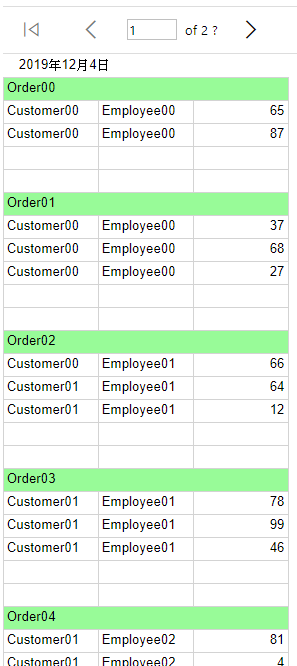

# 插入資料列

群組資料如下圖

- 群組內

  指的是在每一筆資料內

  - 群組內-上方

    指的是在每一筆資料內的上方

    

  - 群組內-下方

    指的是在每一筆資料內的下方

    

- 群組外

  指的是在每一個群組之內，每一筆資料外

  - 群組外-上方

    指的是在每一個群組之內的上方

    

  - 群組外-下方

    指的是在每一個群組之內的下方

    
