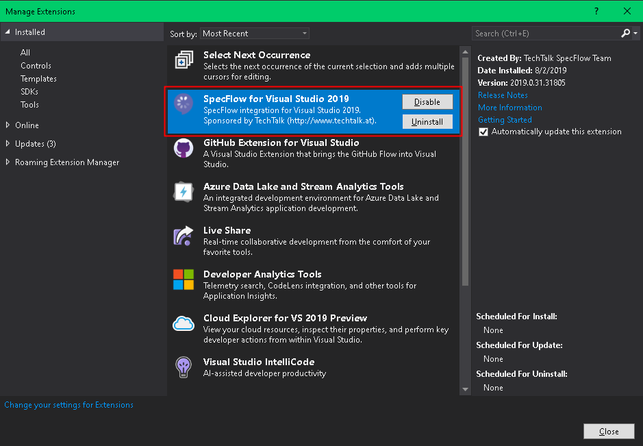
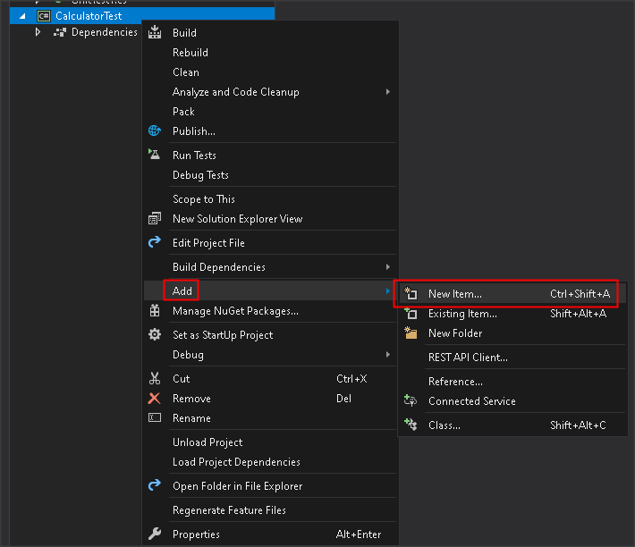
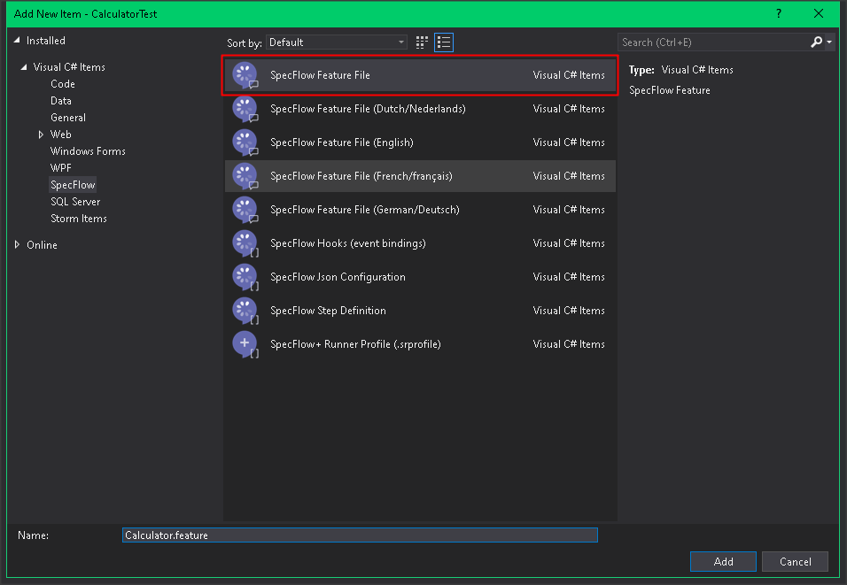
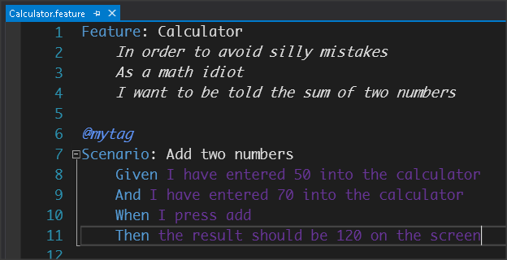
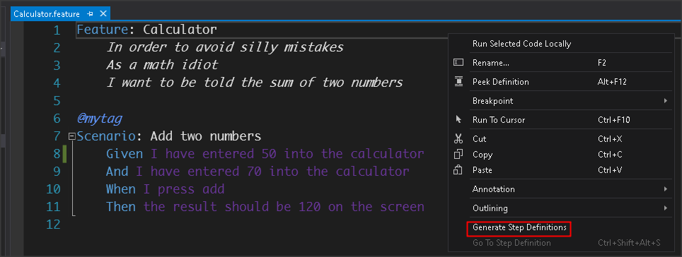
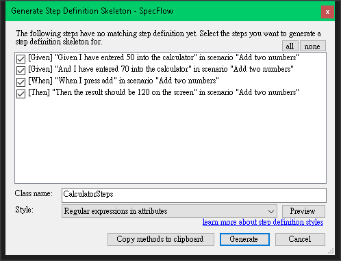
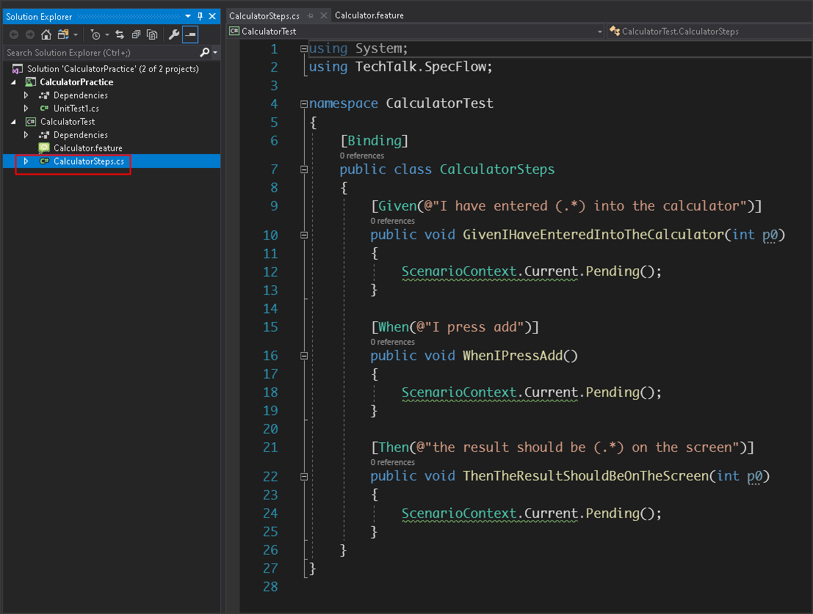

# 初始設定 

## 安裝套件

### Visual Studio 2019

> 安裝套件 SpecFlow For Visual Studio 2019


## 依照不同的測試框架安裝專案套件

### MsTest

- Install-Package SpecFlow
- Install-Package SpecFlow.MsTest
- Install-Package SpecFlow.Tools.MsBuild.Generation

### NUnit

- Install-Package SpecFlow
- Install-Package SpecFlow.Tools.MsBuild.Generation

## 新增 feature 檔




將以下內容，貼至檔案中

```
Feature: Calculator
	In order to avoid silly mistakes
	As a math idiot
	I want to be told the sum of two numbers

@mytag
Scenario: Add two numbers
	Given I have entered 50 into the calculator
	And I have entered 70 into the calculator
	When I press add
	Then the result should be 120 on the screen
```


## 從 feature 檔產生 step 檔





## 編譯

編譯成功

## 設定專案檔 (Optional)

如果不想將 feature.cs 加到專案中，可透過以下設定，讓 VS 在編譯程式時，就可以針對專案內的所有 feature.cs 一同編譯

```xml
<Target Name="AfterUpdateFeatureFilesInProject">
    <!-- include any generated SpecFlow files in the compilation of the project if not included yet -->
    <ItemGroup>
        <Compile Include="**\*.feature.cs" Exclude="@(Compile)" />
    </ItemGroup>
</Target>
```

## 停用每個 feature 的 Custom Tool 設定

(待確認)

透過 SpecFlow For Visual Studio 產生的 feature 檔案，會被設定 Custom Tool

Custom Tool 所使用的功能在 SpecFlow 3 已經不能用了，所以要刪掉
