# Sample - ProcessingMode Local

## 套件

- Visual Studio 套件

    [Microsoft RDLC Report Designer](https://marketplace.visualstudio.com/items?itemName=ProBITools.MicrosoftRdlcReportDesignerforVisualStudio-18001)

    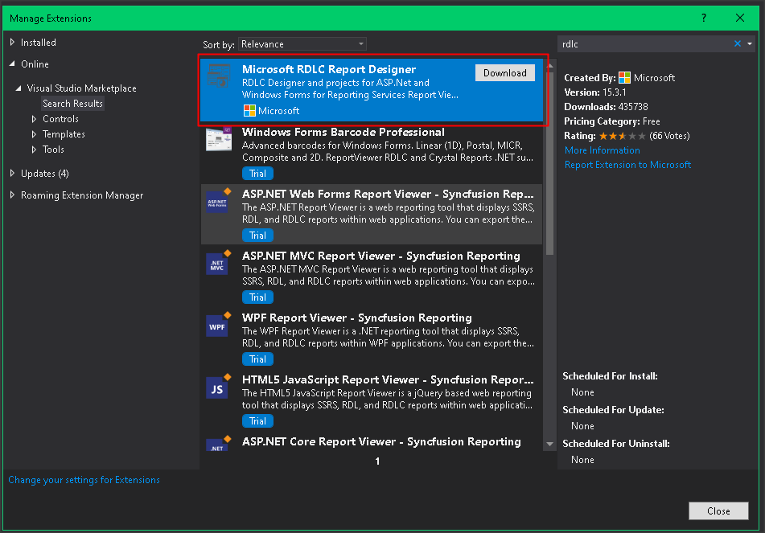

- 專案套件

    [Microsoft.ReportingServices.ReportViewerControl.WebForms](https://www.nuget.org/packages/Microsoft.ReportingServices.ReportViewerControl.WebForms/)

    上述套件安裝完畢後，會在該專案下建立 SqlServerTypes 資料表，該資料夾內會有 x86、x64 資料夾，目前測試後，這二個資料夾是可以刪除的。

    > 注意：千萬不要裝這個套件 > [Microsoft.ReportViewer](https://www.nuget.org/packages/Microsoft.ReportViewer/11.0.3366.16?_src=template) 否則會造成版本混亂

## 報表設計

1. 建立報表的專案

    目前已知在 Asp.Net MVC Empty Project 專案中，無法指定 DataSet 資料來源為 Object，目前測試 Class Library Project 沒有此問題

1. 報表專案安裝套件

    在上述的專案安裝套件 [Microsoft.ReportingServices.ReportViewerControl.WebForms](https://www.nuget.org/packages/Microsoft.ReportingServices.ReportViewerControl.WebForms/)

1. 新增報表 Dto

    這些 Dto 可以放在報表的專案中，或是報表所參考的專案中。

    用來判斷欄位是否顯示

    ```csharp
    public class ReportPersonColumnVisibleDto
    {
        public bool Id { get; set; }
        public bool Name { get; set; }
        public bool Age { get; set; }
    }
    ```

    用來顯示欄位名稱

    ```csharp
    public class ReportPersonColumnNameDto
    {
        public string Id { get; set; }
        public string Name { get; set; }
        public string Age { get; set; }
    }
    ```

    用來顯示欄位資料

    ```csharp
    public class ReportPersonDto
    {
        public int Id { get; set; }
        public string Name { get; set; }
        public int Age { get; set; }
    }
    ```

    Dto 加好後，要記得先編譯，在新增 DataSource > Object 才可以找到 Dto 這些 Model

1. 新增報表
  
    專案 > 新增項目 > 報表 > ReportPerson.rdlc

    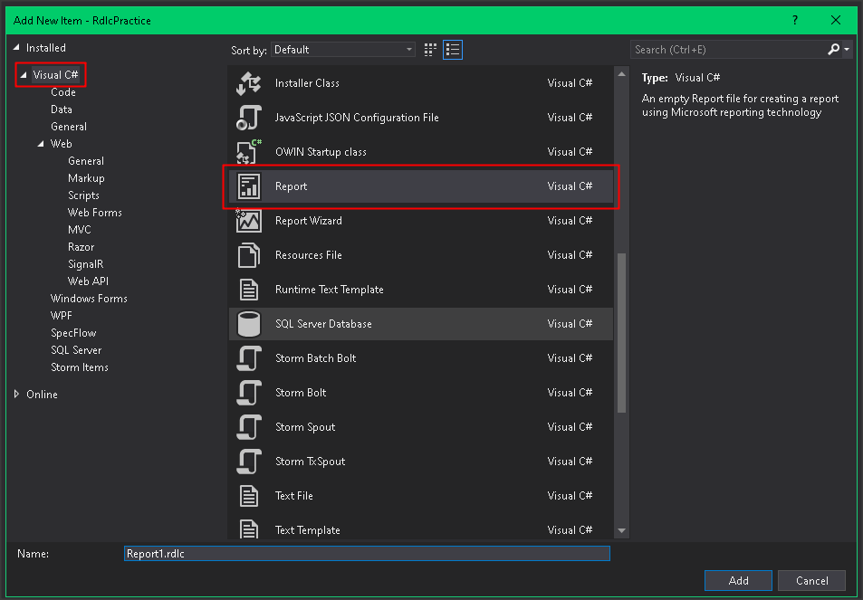

1. 新增 DataSet

    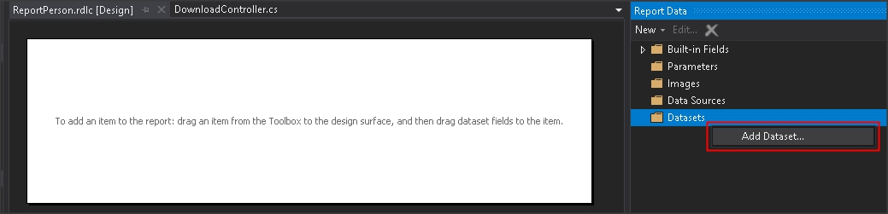

    新增 DataSource

    > 注意：如果在 Asp.Net MVC Empty Project 專案中新增 DataSet > DataSource 時，會沒有下面的畫面 !

    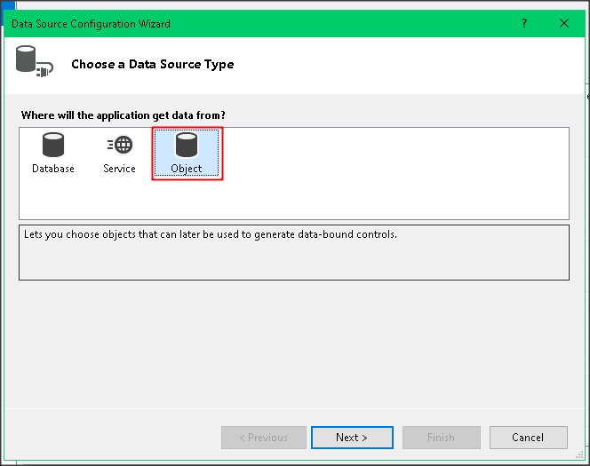

    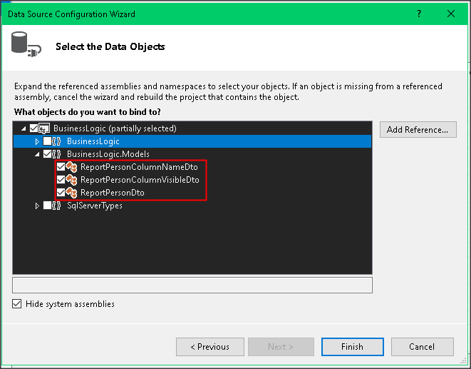xx

    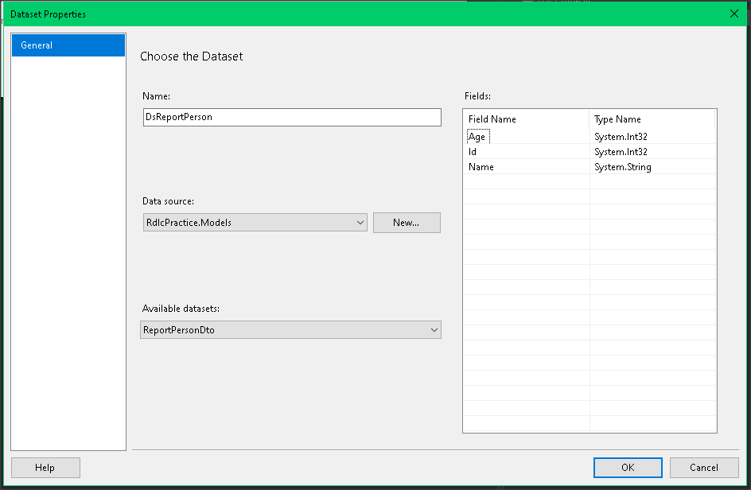

    重覆上述動作，分別建立 DsReportPersonVisible、DsReportPersonColumn、DsReportPerson 這三個 DataSet

    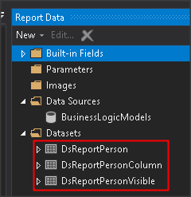

1. 新增表格

    在 Report Designer 的報表顯示區域內，按下滑鼠右鍵，Insert > Table

    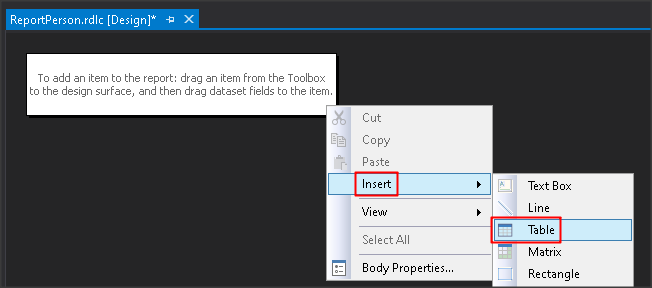

1. 指定 Table 資料來源的 DataSet

    點擊 Table 中任一 Cell 後，在 Table 左上 Cell 按下滑鼠右鍵，選擇 Tablix Properties

    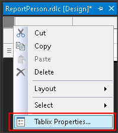

    於 General > DataSet name 選擇指定的 DataSet 做為表格的資料來源

    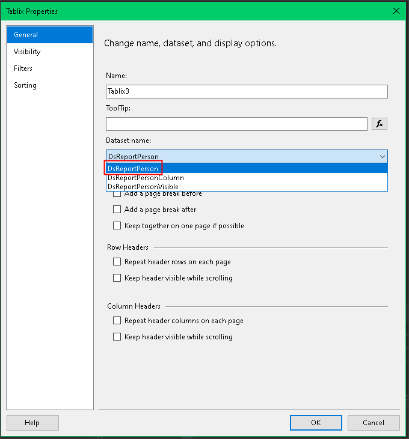

1. 指定 Table 各欄位對應至 DataSet 欄位

    Table 第一列是表格標題的部份

    Table 第二列就是表格資料的部份

    透過在 Table 第二列的每個 Cell 右上角的 Icon 來指定顯示指定欄位的資料

    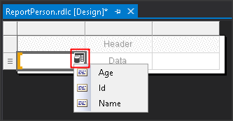

1. 指定 Table 欄位標題

    在 Table 第一列的 Cell 內，按下滑鼠右鍵，選擇 Expression

    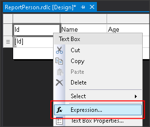

    於 Category 選擇 DataSet

    Item 選擇要做為欄位名稱的 DataSet

    Values 選擇該欄位的值後，記得雙擊滑鼠左鍵，會自動套用 VB 的語法至 expresion 語法中

    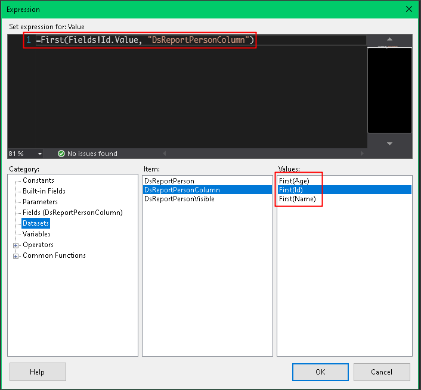

    將所有欄位標題設定完畢

    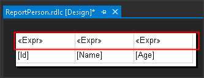

1. 設定欄位動態隱藏

    在表格外框的欄位 Cell 上按下滑鼠右鍵，選擇 Column Visibility

    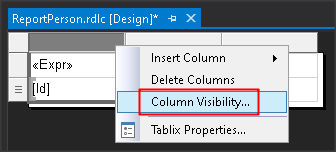

    選擇 Show or hide based an expression

    點擊 fx 的 icon

    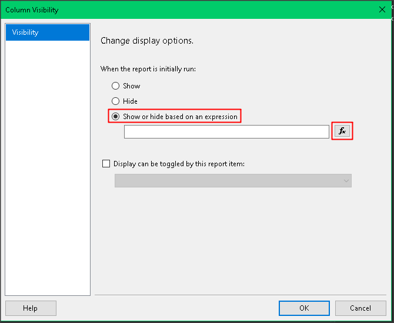

    於 Category 選擇 DataSet

    Item 選擇要做為欄位是否隱藏的 DataSet

    Values 選擇該欄位的值後，記得雙擊滑鼠左鍵，會自動套用 VB 的語法至 expresion 語法中

    > 注意：因為如果 Dto 的欄位意圖是是否顯示欄位，要記得加上 NOT() 語法

    ```vb
    =NOT(First(Fields!Id.Value, "DsReportPersonVisible"))
    ```

    

## 程式語法

1. 產生 Excel Stream 的方式

    ```csharp
    public class ReportPersonBL
    {
        public MemoryStream GetReport()
        {
            // 欄位是否顯示，一定要用 IEnumerable<T> 的資料型態
            var columnVisibleDto = new List<ReportPersonColumnVisibleDto>
                                {
                                    new ReportPersonColumnVisibleDto
                                    {
                                        Id = true,
                                        Name = false,
                                        Age = true
                                    }
                                };

            // 用來顯示欄位名稱，一定要用 IEnumerable<T> 的資料型態
            var columnNameDto = new List<ReportPersonColumnNameDto>
                                {
                                    new ReportPersonColumnNameDto
                                    {
                                        Id = "編號",
                                        Name = "名字",
                                        Age = "年齡"
                                    }
                                };

            // 欄位的值
            var cellDtos = new List<ReportPersonDto>
            {
                new ReportPersonDto
                {
                    Id = 1,
                    Name = "A",
                    Age = 18,
                },
                new ReportPersonDto
                {
                    Id = 2,
                    Name = "B",
                    Age = 19,
                },
                new ReportPersonDto
                {
                    Id = 3,
                    Name = "C",
                    Age = 20,
                },
                new ReportPersonDto
                {
                    Id = 4,
                    Name = "D",
                    Age = 21,
                },
                new ReportPersonDto
                {
                    Id = 5,
                    Name = "E",
                    Age = 22,
                },
            };

            var reportViewer = new ReportViewer();
            reportViewer.ProcessingMode = ProcessingMode.Local;
            // reportViewer.LocalReport.ReportPath = $"{Request.MapPath(Request.ApplicationPath)}Report\\報表名稱.rdlc";
            reportViewer.LocalReport.ReportEmbeddedResource = "BusinessLogic.RDLC.ReportPerson.rdlc";
            reportViewer.LocalReport.DataSources.Add(new ReportDataSource("DsReportPersonVisible", columnVisibleDto));
            reportViewer.LocalReport.DataSources.Add(new ReportDataSource("DsReportPersonColumn", columnNameDto));
            reportViewer.LocalReport.DataSources.Add(new ReportDataSource("DsReportPerson", cellDtos));

            var reportStreamBytes = reportViewer.LocalReport.Render("EXCELOPENXML", null, out var mimeType, out var encoding, out var extension, out var streamids, out var warnings);
            var reportStream = new MemoryStream(reportStreamBytes);

            return reportStream;
        }
    }
    ```

1. 指定 Local RDLC 的方式有二種

    a. LocalReport.ReportPath - 以絕對路徑的方式給定

    a. LocalReport.ReportEmbeddedResource - 以 namespace 的方式給定

1. 指定格式

    LocalReport.Render() 的第一個引數，就是指定 Report 輸出的格式，對照表如下：

    |檔案類型|Format 字串|
    |:------|:----------|
    |Excel 2003| Excel|
    |Excel|EXCELOPENXML|
    |TIFF File | IMAGE |
    |PDF|PDF|
    |Word 2003 | WORD|
    |Word|WORDOPENXML|

1. WebApi 2 的回傳語法

    ```csharp
    public class DownloadController : ApiController
    {
        [HttpGet, Route("api/Download/Excel")]
        public IHttpActionResult Excel()
        {
            var reportStream = new ReportPersonBL().GetReport();

            var response = new HttpResponseMessage(HttpStatusCode.OK);
            var fileName = "Test.xlsx";
            response.Content = new StreamContent(reportStream);
            response.Content.Headers.ContentDisposition = new ContentDispositionHeaderValue("attachment");
            response.Content.Headers.ContentDisposition.FileName = fileName;
            response.Content.Headers.ContentType = new MediaTypeHeaderValue(MimeMapping.GetMimeMapping(fileName));
            response.Content.Headers.ContentLength = reportStream.Length; //告知瀏覽器下載長度
            return ResponseMessage(response);
        }
    }
    ```
