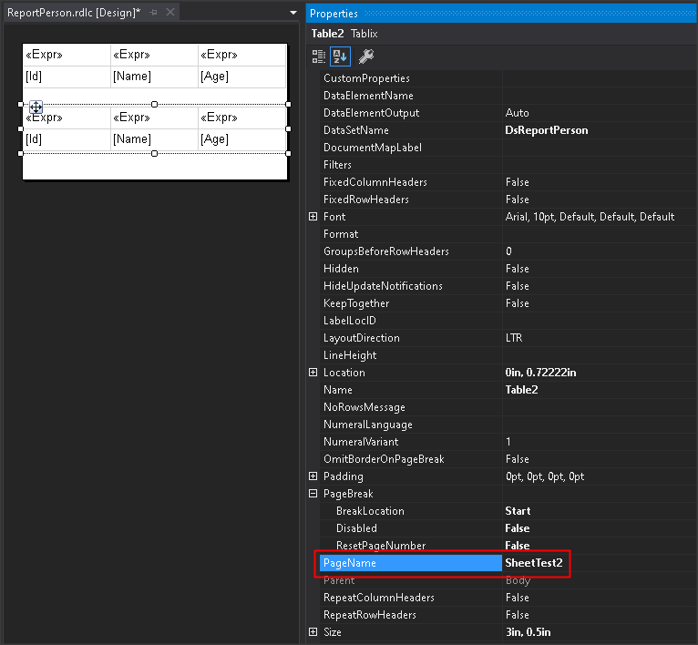

# 產生多個 Excel Sheet 的方式

## 第立第二個 Sheet

1. 建立第二個 Table

1. 設定 Page Break 至 Table Start

    有二個方式

    a. 進入 Tablix Properties 視窗 > General > Page break options > 把 *Add a page break before* 打勾

    b. 開啟 Tablix Properties Panel > PageBreak > BreakLocation > 設定為 *Start*

1. 設定 Sheet Name 的方式

    開啟 Tablix Properties Panel

    設定 PageName，匯出成 Excel 時，就會變成 Sheet Name

    
