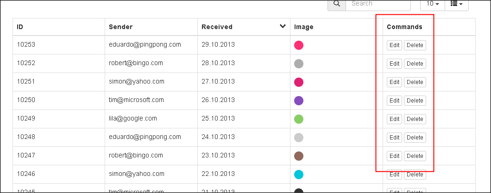

# 自訂欄位套用固定 template

- [自訂欄位套用固定 template](#%e8%87%aa%e8%a8%82%e6%ac%84%e4%bd%8d%e5%a5%97%e7%94%a8%e5%9b%ba%e5%ae%9a-template)
  - [增加自訂功能欄位](#%e5%a2%9e%e5%8a%a0%e8%87%aa%e8%a8%82%e5%8a%9f%e8%83%bd%e6%ac%84%e4%bd%8d)
  - [圖示按鈕](#%e5%9c%96%e7%a4%ba%e6%8c%89%e9%88%95)

---

## 增加自訂功能欄位



```js
$(document).ready(function(){
  $("#data-table").bootgrid({
    formatters: {
       "image": function(column, row) {
             return "";
        }, 
        "commands": function(column, row) {
              return "<button type="button" class="btn btn-xs btn-default command-edit" data-row-id="" + row.id + "">Edit</button> " +  
                                "<button type="button" class="btn btn-default btn-xs command-delete" data-row-id="" + row.id + "">Delete</button>";
         }
    }
  })
})
```

```html
<section>
  <h3>Bootgrid with Image and Button cells</h3>
  <table class="table table-bordered" id="data-table">
    <thead>
      <tr>
        <th data-column-id="id" data-type="numeric">ID</th>
        <th data-column-id="sender">Sender</th>
        <th data-column-id="received" data-order="desc">Received</th>
        <th
          data-column-id="imgsrc"
          data-identifier="true"
          data-type="string"
          data-visible="false"
        >
          Img src
        </th>
        <th data-column-id="image" data-formatter="image">Image</th>
        <th
          data-column-id="commands"
          data-formatter="commands"
          data-sortable="false"
        >
          Commands
        </th>
      </tr>
    </thead>
    <tbody>
      <tr>
        <td>10238</td>
        <td>eduardo@pingpong.com</td>
        <td>14.10.2013</td>
        <td>
          https://placeholdit.imgix.net/~text?txtsize=23&bg=F44336&txtclr=ffffff&w=50&h=50
        </td>
      </tr>
      <tr>
        <td>10243</td>
        <td>eduardo@pingpong.com</td>
        <td>19.10.2013</td>
        <td>
          https://placeholdit.imgix.net/~text?txtsize=23&bg=9C27B0&txtclr=ffffff&w=50&h=50
        </td>
      </tr>
      <tr>
        <td>10248</td>
        <td>eduardo@pingpong.com</td>
        <td>24.10.2013</td>
        <td>https://placeholdit.imgix.net/~text?txtsize=2&w=50&h=50</td>
      </tr>
      <tr>
        <td>10253</td>
        <td>eduardo@pingpong.com</td>
        <td>29.10.2013</td>
        <td>
          https://placeholdit.imgix.net/~text?txtsize=23&bg=E91E63&txtclr=ffffff&w=50&h=50
        </td>
      </tr>
      <tr>
        <td>10234</td>
        <td>lila@google.com</td>
        <td>10.10.2013</td>
        <td>
          https://placeholdit.imgix.net/~text?txtsize=23&bg=3F51B5&txtclr=ffffff&w=50&h=50
        </td>
      </tr>
      <tr>
        <td>10239</td>
        <td>lila@google.com</td>
        <td>15.10.2013</td>
        <td>
          https://placeholdit.imgix.net/~text?txtsize=23&bg=2196F3&txtclr=ffffff&w=50&h=50
        </td>
      </tr>
      <tr>
        <td>10244</td>
        <td>lila@google.com</td>
        <td>20.10.2013</td>
        <td>
          https://placeholdit.imgix.net/~text?txtsize=23&bg=2196F3&txtclr=ffffff&w=50&h=50
        </td>
      </tr>
      <tr>
        <td>10249</td>
        <td>lila@google.com</td>
        <td>25.10.2013</td>
        <td>
          https://placeholdit.imgix.net/~text?txtsize=23&bg=8BC34A&txtclr=ffffff&w=50&h=50
        </td>
      </tr>
      <tr>
        <td>10237</td>
        <td>robert@bingo.com</td>
        <td>13.10.2013</td>
        <td>
          https://placeholdit.imgix.net/~text?txtsize=23&bg=FF9800&txtclr=ffffff&w=50&h=50
        </td>
      </tr>
      <tr>
        <td>10242</td>
        <td>robert@bingo.com</td>
        <td>18.10.2013</td>
        <td>
          https://placeholdit.imgix.net/~text?txtsize=23&bg=FF5722&txtclr=ffffff&w=50&h=50
        </td>
      </tr>
      <tr>
        <td>10247</td>
        <td>robert@bingo.com</td>
        <td>23.10.2013</td>
        <td>
          https://placeholdit.imgix.net/~text?txtsize=23&bg=795548&txtclr=ffffff&w=50&h=50
        </td>
      </tr>
      <tr>
        <td>10252</td>
        <td>robert@bingo.com</td>
        <td>28.10.2013</td>
        <td>
          https://placeholdit.imgix.net/~text?txtsize=23&bg=9E9E9E&txtclr=ffffff&w=50&h=50
        </td>
      </tr>
      <tr>
        <td>10236</td>
        <td>simon@yahoo.com</td>
        <td>12.10.2013</td>
        <td>
          https://placeholdit.imgix.net/~text?txtsize=23&bg=000000&txtclr=ffffff&w=50&h=50
        </td>
      </tr>
      <tr>
        <td>10241</td>
        <td>simon@yahoo.com</td>
        <td>17.10.2013</td>
        <td>
          https://placeholdit.imgix.net/~text?txtsize=23&bg=607D8B&txtclr=ffffff&w=50&h=50
        </td>
      </tr>
      <tr>
        <td>10246</td>
        <td>simon@yahoo.com</td>
        <td>22.10.2013</td>
        <td>
          https://placeholdit.imgix.net/~text?txtsize=23&bg=00BCD4&txtclr=ffffff&w=50&h=50
        </td>
      </tr>
      <tr>
        <td>10251</td>
        <td>simon@yahoo.com</td>
        <td>27.10.2013</td>
        <td>
          https://placeholdit.imgix.net/~text?txtsize=23&bg=C51162&txtclr=ffffff&w=50&h=50
        </td>
      </tr>
      <tr>
        <td>10235</td>
        <td>tim@microsoft.com</td>
        <td>11.10.2013</td>
        <td>
          https://placeholdit.imgix.net/~text?txtsize=23&bg=00BCD4&txtclr=ffffff&w=50&h=50
        </td>
      </tr>
      <tr>
        <td>10240</td>
        <td>tim@microsoft.com</td>
        <td>16.10.2013</td>
        <td>
          https://placeholdit.imgix.net/~text?txtsize=23&bg=827717&txtclr=ffffff&w=50&h=50
        </td>
      </tr>
      <tr>
        <td>10245</td>
        <td>tim@microsoft.com</td>
        <td>21.10.2013</td>
        <td>
          https://placeholdit.imgix.net/~text?txtsize=23&bg=212121&txtclr=ffffff&w=50&h=50
        </td>
      </tr>
      <tr>
        <td>10250</td>
        <td>tim@microsoft.com</td>
        <td>26.10.2013</td>
        <td>
          https://placeholdit.imgix.net/~text?txtsize=23&bg=673AB7&txtclr=ffffff&w=50&h=50
        </td>
      </tr>
    </tbody>
  </table>
</section>
```
[資料來源](https://codepen.io/rushenn/pen/OVrwog?editors=1010)

## 圖示按鈕

```json
 formatters: {
                "commands": function(column, row)
                {
                    return "<button type=\"button\" class=\"btn btn-xs btn-default command-edit\" data-row-id=\"" + row.id + "\"><span class=\"glyphicon glyphicon-edit\"></span></button> " + 
                        "<button type=\"button\" class=\"btn btn-xs btn-default command-delete\" data-row-id=\"" + row.id + "\"><span class=\"glyphicon glyphicon-trash\"></span></button>";
                }
            }
```