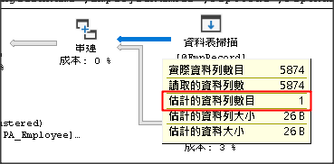

# OPTION (RECOMPILE)

[[SQL Server] Parameter Sniffing: OPTION (RECOMPILE)](http://sharedderrick.blogspot.com/2018/02/sql-server-parameter-sniffing-option.html)

## 需要套 OPTION (RECOMPILE) 的情境

當執行計劃的**估計的資料列數目**與**實際的資料列數目**差距超過十倍以上時，有讀取 資料表變數 @xxx 的地方，在所有查詢的地方下面都要加上 OPTION (RECOMPILE)，就會讓查詢可以使用正確的執行計劃，但會消耗更多 CPU 資源。

> 聽說 SQL Server 2019 已修正

