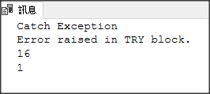

# TRY CATCH RAISERROR

Message、Severity、State 這三個是自訂的

```sql
BEGIN TRY
    RAISERROR ('Error raised in TRY block.', -- Message text.  
    16, -- Severity.  
    1 -- State.  
            );  
END TRY
BEGIN CATCH
    PRINT 'Catch Exception'
    PRINT ERROR_MESSAGE()
    PRINT ERROR_SEVERITY()
    PRINT ERROR_STATE()
END CATCH
```


