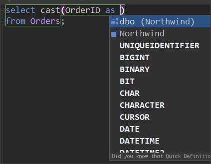
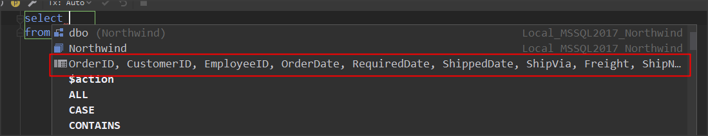
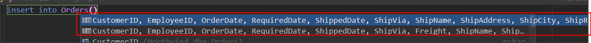
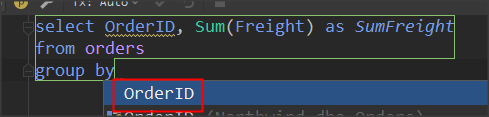
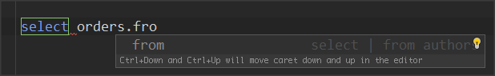
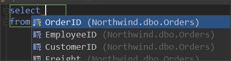
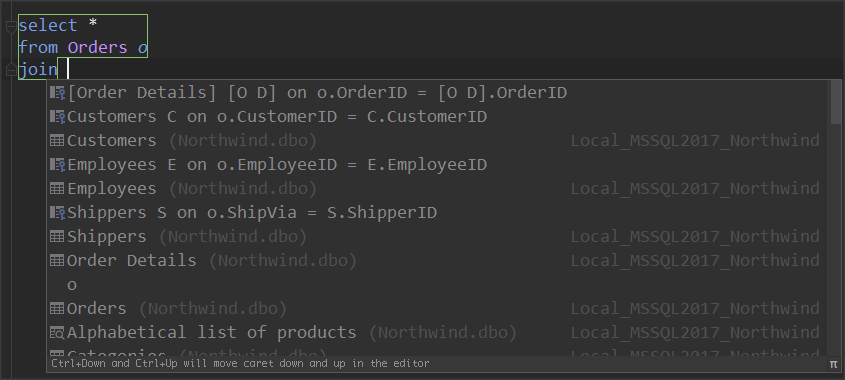

資料來源：[Code completion](https://www.jetbrains.com/help/datagrip/auto-completing-code.html)

## sel

輸入 sel 後，按下 Tab，會產生以下語法

```sql
select *
from ;
```

## cast

輸入至以下語法的 orderid.cast 時，按下 Tab

```sql
select OrderID.cast
from Orders;
```

就會產生



# select 所有欄位
### 步驟：
1. 先輸入
    ```sql
    select 
    from orders
    ```
1. 在 select 後面加一個空格後，按下 ctrl + space ，會列出所有 code completion 項目，在中間會有所有欄位的項目
    
    

# insert 所有欄位
### 步驟：
1. 先輸入
    ```sql
    insert into Orders()
    ```
1. 在 () 中間按下 ctrl + space 後，code completion 項目
    - 第一個是所有欄位
    - 第二個是所有欄位，但不包括給定 default 欄位


# group by 欄位
### 步驟：
1. 先輸入要 select 的欄位
    ```sql
    select OrderID, Sum(Freight) as SumFreight
    from orders
    group by 
    ```
1. 在 gorup by 後面加一個空何後，按下 ctrl + space ，會列出 group by 的欄位


# from
產生指定欄位的 select column from table 的語法

### 步驟：
1. 先輸入
    ```sql
    select orders.from
    ```
1. 就會列出 code completion
    
1. 移至 from 按下 Tab 後，就會自動產生對應語法
    

# cfrom
產生欄位的 select column from table 的語法

### 步驟：
1. 先輸入
    ```sql
    select orders.cfrom
    ```
1. 移至 cfrom 按下 Tab 後，就會自動產生對應語法
    ```sql
    select OrderID,
           CustomerID,
           EmployeeID,
           OrderDate,
           RequiredDate,
           ShippedDate,
           ShipVia,
           Freight,
           ShipName,
           ShipAddress,
           ShipCity,
           ShipRegion,
           ShipPostalCode,
           ShipCountry
    from orders
    ```

# afrom
產生欄位的 select column `as alias_column` from table 的語法

### 步驟：
1. 先輸入
    ```sql
    select orders.afrom
    ```
1. 移至 afrom 按下 Tab 後，就會自動產生對應語法
    ```sql
    select OrderID        as OI,
           CustomerID     as CI,
           EmployeeID     as EI,
           OrderDate      as OD,
           RequiredDate   as RD,
           ShippedDate    as SD,
           ShipVia        as SV,
           Freight        as F,
           ShipName       as SN,
           ShipAddress    as SA,
           ShipCity       as SC,
           ShipRegion     as SR,
           ShipPostalCode as SPC,
           ShipCountry    as S
    from orders
    ```

# join
產生 join table on column = column 的語法

### 步驟：
1. 先輸入
    ```sql
    select *
    from Orders o
    join 
    ```
1. 在 join 後方按下空白鍵後，就會顯示 FK 關聯的資料表及欄位
    
1. 移至要產生的項目後，按下 Tab 後，就會自動產生對應語法
    ```sql
    select *
    from Orders o
    join [Order Details] [O D] on o.OrderID = [O D].OrderID
    ```