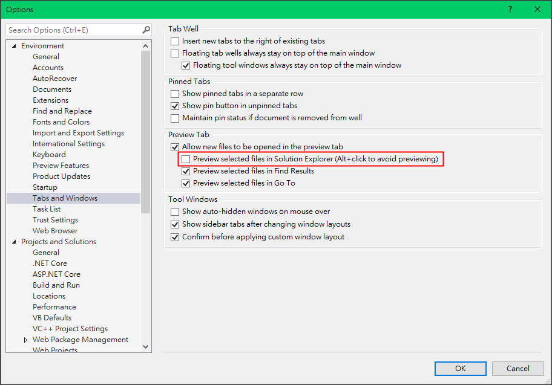

# 點擊方案總管檔案時關閉預覽

取消勾選 Options > Environment > Tabs and Windows > uncheck "Preview selected files in Solution Explorer"

## debug 時，會另開新視窗，不會開分頁，結束 debug mode 時，又關掉視窗

請參考圖片的做法，有二個地方需要設定

[參考資料](https://stackoverflow.com/questions/40729535/how-to-stop-browser-closing-automatically-when-you-stop-debugging-on-vs-2017)
