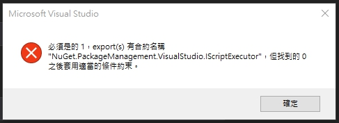

# 新增專案失敗

- Q：在新增專案時，會出現以下錯誤訊息

  

  英文版錯誤訊息

  > Operation failed Expected 1 export(s) with contract name "NuGet.Configuration.ISettings" but found 0 after applying applicable constraints

- A：解決方式

  將 C:\Users\{user}\AppData\Local\Microsoft\VisualStudio\{visual studio 版號}\_{8 位亂數} 中的 `ComponentModelCache` 刪除

- 參考資料

  - [Nuget 包安装问题](https://www.qingtingip.com/h_368708.html)
